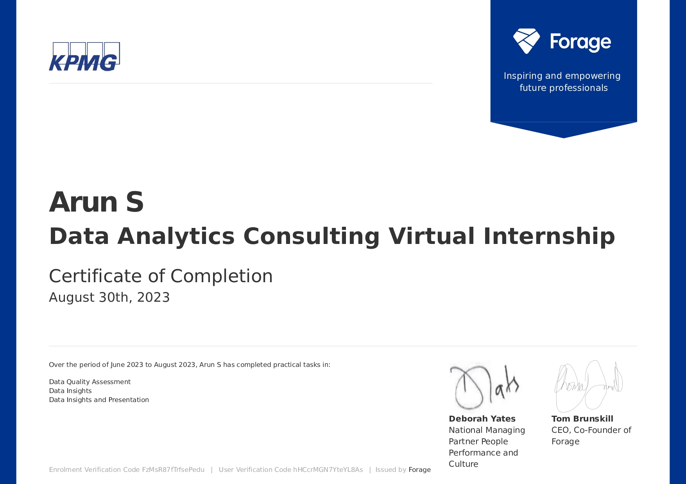

# KPMG Virtual Internship

**Task 1:** Data Quality Assessment(Assessment of data quality and completeness in preparation for analysis)  
**solution:** sending email to the client identifying the data quality issues and strategies to mitigate these issues.
solution available [here](Task_1(Data_Quality_Assessment)\KPMG_Task_1_email_solution.docx)

**Task 2:** Data Insights(Targeting high value customers based on customer demographics and attributes)  
**solution:**  recommend which of these 1000 new customers should be targeted to drive the most value for the organisation. need to start with a PowerPoint presentation which outlines the approach which we will be taking. The client has agreed on a 3 week scope with the following 3 phases as follows - Data Exploration; Model Development and Interpretation.
solution available [here](Task_2(Data_Insights)\KPMG_Task_2.pptx)

**Task 3:** Data Insights and Presentation(Using visualisations to present insights)  
**solution:** develop a dashboard that we can present to the client. Display your data summary and results of the analysis in a dashboard (see tools/references for assistance). Specifically, presentation should specify who Sprocket Central Pty Ltd’s marketing team should be targeting out of the new 1000 customer list as well as the broader market segment to reach out to.
solution available [here](https://public.tableau.com/views/KPMGTask3_16928490325340/KPMGTask3?:language=en-GB&:display_count=n&:origin=viz_share_link)

/KPMG_Task_3.png)

## Certification

